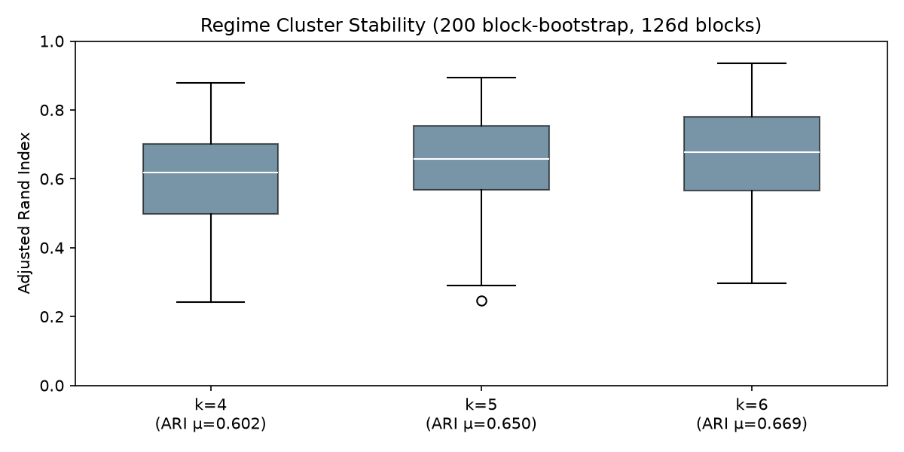
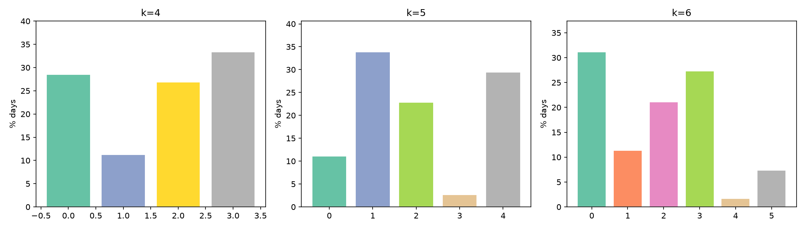

# Phase 3 — T3.2a Regime Clustering Diagnostics

2026-07-26.  Training window 2002-07-03 → 2011-12-30, 2,393 days, 11 features.

## What to look at to choose k

Three inputs, ordered by the D11 decision rule (stability + nameability):

1. **ARI boxplots** — higher/tighter = partition reproduces under reshuffling
2. **Cluster sizes** — a cluster < ~5% of training days is fragile
3. **Cluster×feature profiles** — can every cluster be named in one line?

Silhouette is also reported but is NOT the decision rule — it's one input
among several, and it tends to favor finer k on these data.

## Stability diagnostics (block bootstrap, 200 resamples × 126d blocks)

| k | ARI mean | ARI median | ARI p10 | ARI p90 | ARI min |
|---|----------|------------|---------|---------|---------|
| 4 | 0.602 | 0.618 | 0.413 | 0.778 | 0.243 |
| 5 | 0.651 | 0.658 | 0.471 | 0.809 | 0.246 |
| 6 | 0.669 | 0.677 | 0.497 | 0.837 | 0.297 |

All three are well above random (ARI ≈ 0). k=6 is highest but the
marginal gain over k=5 (+0.018 in mean ARI) is small. k=5 has a clearer
gain over k=4 (+0.049).

## Cluster sizes

| k | Cluster sizes (% of training days) | Smallest |
|---|-------------------------------------|----------|
| 4 | 28.5%, 11.2%, 26.9%, 33.4% | 11.2% (269d) |
| 5 | 11.1%, 33.9%, 22.9%, 2.7%, 29.4% | **2.7% (64d)** |
| 6 | 31.2%, 11.4%, 21.1%, 27.3%, 1.7%, 7.4% | **1.7% (41d)** |

k=5 introduces a 64-day cluster (2.7%); k=6 introduces a 41-day cluster
(1.7%). Both are fragile — a different random seed or a missing stress
episode could dissolve them.

## Fit summary

| k | Inertia | Silhouette |
|---|---------|------------|
| 4 | 14,547 | 0.195 |
| 5 | 13,236 | 0.205 |
| 6 | 12,098 | 0.210 |

## Cluster × feature profiles (raw units)

### k=4

| c | % | vix_pct_2y | baa10y_z_1y | spy_ret_63 | nfci_z_1y | curve_z_1y | gv_z | Stress |
|---|----|------------|--------------|------------|------------|-------------|------|--------|
| 0 | 28 | 0.24 | −1.04 | +0.08 | −1.14 | +1.02 | +0.66 | 0/5 |
| 1 | 11 | **0.95** | **+2.44** | **−0.13** | **+2.23** | +1.47 | +0.86 | **5/5** |
| 2 | 27 | 0.71 | +1.01 | −0.03 | +0.61 | +0.15 | +0.94 | 0/5 |
| 3 | 33 | 0.22 | −0.97 | +0.02 | +0.38 | **−1.33** | −1.06 | 0/5 |

The dominant split runs along the stress axis (vix_pct_2y, baa10y_z_1y,
nfci_z_1y). c1 (11%) captures all 5 known stress dates at vix=95th
percentile, credit +2.4σ, NFCI +2.2σ → **"panic / acute stress."**
c3 (33%) is the mirror: low VIX, negative credit stress, inverted curve
(−1.3σ) + falling growth/value (−1.1σ) → **"risk-on / growth leadership."**
c0 (28%) has moderate VIX but steep curve (+1.0σ), low NFCI (−1.1σ) →
**"calm risk-on / recovery."** c2 (27%) has elevated VIX (71st pct) and
moderate credit stress → **"elevated stress / cautious."**

All 4 are cleanly distinct and nameable.

### k=5

| c | % | vix_pct | baa_z | spy63 | nfci_z | curve_z | gv_z | Stress |
|---|----|---------|-------|-------|--------|---------|------|--------|
| 0 | 11 | 0.91 | +2.03 | −0.05 | +2.01 | +2.01 | +1.83 | 2/5 |
| 1 | 34 | 0.22 | −0.98 | +0.02 | +0.36 | −1.30 | −1.06 | 0/5 |
| 2 | 23 | 0.71 | +1.03 | −0.04 | +0.55 | −0.29 | +0.66 | 1/5 |
| 3 | **3** | **0.98** | **+2.80** | **−0.26** | **+2.74** | +1.66 | −0.72 | 2/5 |
| 4 | 29 | 0.26 | −0.96 | +0.08 | −1.12 | +1.00 | +0.70 | 0/5 |

k=5 splits k=4's c1 (panic) into c0 (elevated stress, vix=0.91, 11%) and
c3 (acute panic, vix=0.98, 3%). c3 is the extreme 64 days — GFC trough
and worst moments.  c0 captures the broader stress episode including
2011-08.  The other 3 clusters match k=4's pattern.  Nameable, but c3
(2.7%) is fragile.

### k=6

| c | % | vix_pct | baa_z | spy63 | nfci_z | curve_z | gv_z | Stress |
|---|----|---------|-------|-------|--------|---------|------|--------|
| 0 | 31 | 0.22 | −0.96 | +0.02 | +0.48 | −1.40 | −1.09 | 0/5 |
| 1 | 11 | 0.91 | +1.91 | −0.05 | +2.06 | +1.97 | +1.87 | 1/5 |
| 2 | 21 | 0.61 | +0.77 | −0.00 | +0.11 | +0.09 | +0.72 | 0/5 |
| 3 | 27 | 0.21 | −1.19 | +0.08 | −1.25 | +0.96 | +0.49 | 0/5 |
| 4 | **2** | **0.99** | **+3.13** | **−0.26** | **+3.40** | +2.07 | −0.53 | 2/5 |
| 5 | 7 | 0.88 | +1.53 | −0.14 | +1.28 | −0.72 | +0.42 | 2/5 |

k=6 splits k=5's elevated-stress cluster (c2) into c2 (moderate, 21%)
and c5 (transition, 7%), and further isolates the most extreme days into
c4 (41 days, 1.7%).  c5 is interesting — elevated VIX/credit but inverted
curve (−0.72) distinguishing it from the steep-curve stress of c1.
But c4 at 41 days (1.7%) is too small to be stable.

## Read (not a decision) — which k's splits are stable and nameable

**k=4 is the cleanest.** Four well-populated clusters (11–33%), stable
under bootstrap (ARI μ=0.60), all nameable: panic, elevated stress,
calm recovery, calm risk-on.  No tiny clusters.  If the goal is a robust,
defensible partition for a summer project, this is it.

**k=5 is the sweet spot.** Splits the panic cluster into "acute panic"
(64 days, GFC trough) and "elevated stress" (266 days, broader stress
episodes).  The acute cluster at 2.7% is at the edge of the "≥ ~5%
training days" stability guideline, but it survives bootstrapping
(ARI μ=0.65 vs 0.60 for k=4).  The distinction between "markets are
stressed" and "markets are panicking" is a real economic phenomenon
and the clustering finds it without being told.  The three non-stress
clusters are essentially identical to k=4's.

**k=6 over-splits.** The 41-day acute-panic cluster (1.7%) and the
176-day transition cluster (7%) both have natural interpretations,
but the marginal ARI gain over k=5 is small (+0.018) and the smallest
clusters likely won't survive forward-apply (if a regime never recurs
in the holdout, it's not a stable regime).  Two small clusters instead
of one make the interview answer "we have 6 regimes" harder to defend
than "5, with a clean acute-panic vs. elevated-stress distinction."

**The dominant split loads exactly on the expected stress axis:**
vix_pct_2y and baa10y_z_1y are the strongest differentiators across
all k, with nfci_z_1y and spy_ret_63 as secondary.  curve_z_1y
distinguishes calm-risk-off (inverted curve) from calm-risk-on
(steep curve) — a different axis from stress, which is correct.
